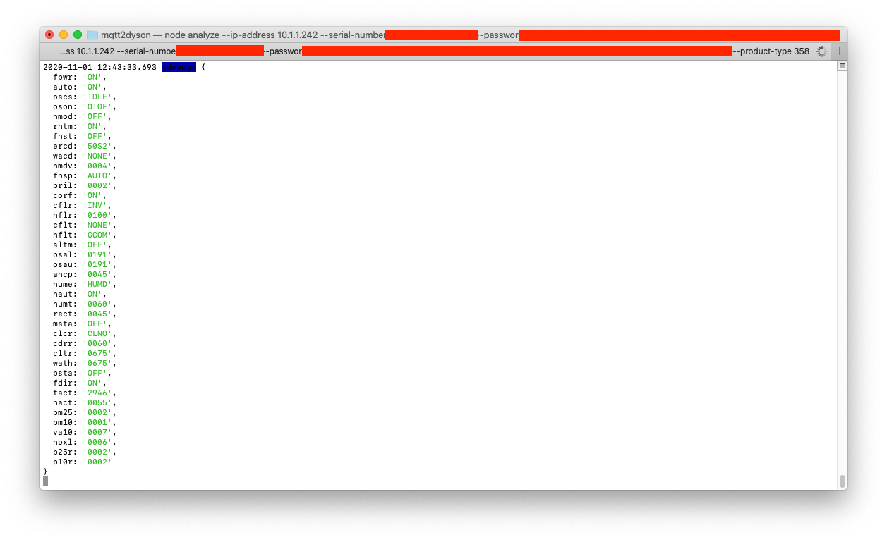

## Usage

    docker run -d dersimn/mqtt2dyson \
        --ip-address 10.1.1.242 \
        --serial-number "" \
        --password "" \
        --product-type 358 \
        --mqtt-url mqtt://10.1.1.100

### Test with Web UI

    docker run -d --rm \
        -p 8000:80 \
        -v "$(pwd)/contrib/data.yaml":/www/data.yaml:ro \
        -e "MQTT_HOST=host.docker.internal:9001" \
        dersimn/mqtt-smarthome-webui

## Debug

Run Script:

    node index -v debug --ip-address 10.1.1.242 --serial-number "" --password "" --product-type 358 --mqtt-url mqtt://10.1.1.100

Run Analyzer Script:

    node analyze --ip-address 10.1.1.242 --serial-number "" --password "" --product-type 358

