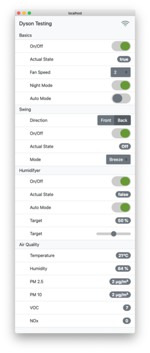
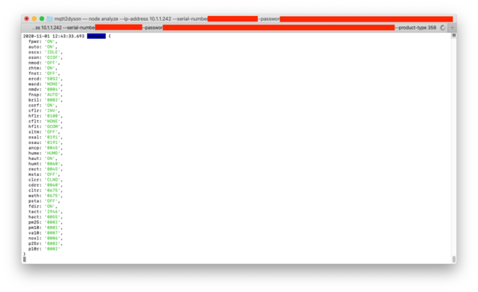

Tested with:

- Dyson Pure Humidify+Cool (PH01)

## Usage

Get your local credentials with your Dyson account:

    docker run --rm --entrypoint "node" dersimn/mqtt2dyson-link cloud \
        --email simon@christmann.email \
        --password secret_password_1234 \
        --country DE

Output will show something like

    {
        Name: 'Simon‘s Zimmer',
        'Product Type': '358',
        'Serial / Username': '…',
        Password: '…'
    }

Then run with the given data from above:

    docker run -d dersimn/mqtt2dyson-link \
        --ip-address 10.1.1.242 \
        --serial-number "…" \
        --password "…" \
        --product-type 358 \
        --mqtt-url mqtt://10.1.1.100

### Test with Web UI

    docker run -d --rm \
        -p 8000:80 \
        -v "$(pwd)/contrib/data.yaml":/www/data.yaml:ro \
        -e "MQTT_HOST=host.docker.internal:9001" \
        dersimn/mqtt-smarthome-webui

## Debug

Run Script:

    node index -v debug --ip-address 10.1.1.242 --serial-number "" --password "" --product-type 358 --mqtt-url mqtt://10.1.1.100

Run Analyzer Script:

    node analyze --ip-address 10.1.1.242 --serial-number "" --password "" --product-type 358

Docker Hub deploy:

    docker buildx create --name mybuilder
    docker buildx use mybuilder
    docker buildx build --platform linux/amd64,linux/arm/v7 -t dersimn/mqtt2dyson-link -t dersimn/mqtt2dyson-link:0.0.1 --push .

## Credits

- [libpurecoollink](http://github.com/CharlesBlonde/libpurecoollink)
- [homebridge-dyson-link](https://github.com/joe-ng/homebridge-dyson-link)
- [homebridge-dyson-pure-cool](https://github.com/lukasroegner/homebridge-dyson-pure-cool)